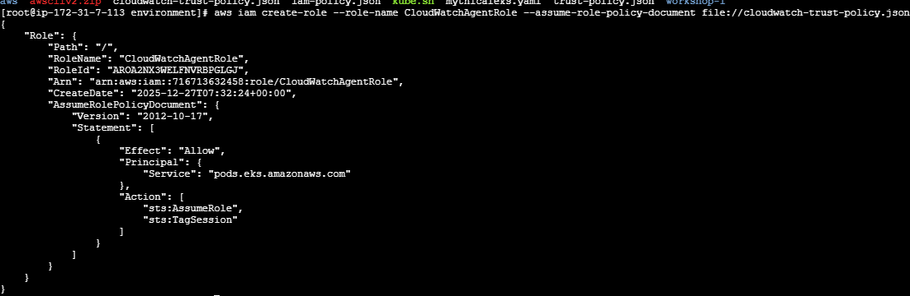

#  We are going to enable AWS Container Insights using the Amazon CloudWatch Observability EKS add-on.

# Create trust policy for Pod Identity
cat > cloudwatch-trust-policy.json <<EOF
{
  "Version": "2012-10-17",
  "Statement": [
    {
      "Effect": "Allow",
      "Principal": {
        "Service": "pods.eks.amazonaws.com"
      },
      "Action": [
        "sts:AssumeRole",
        "sts:TagSession"
      ]
    }
  ]
}
EOF
# Create IAM role for CloudWatch agent
aws iam create-role --role-name CloudWatchAgentRole --assume-role-policy-document file://cloudwatch-trust-policy.json
aws iam attach-role-policy --role-name CloudWatchAgentRole --policy-arn arn:aws:iam::aws:policy/CloudWatchAgentServerPolicy

# Cloudwatch pods are running 
kubectl get pods -n amazon-cloudwatch

Great! You have configured successfully Cloudwatch to monitor Container Metrics

Cluster: Overall cluster health and resource utilization
Nodes: Individual node performance metrics
Pods: Pod-level metrics and logs
Services: Service-level performance data

# Key metrics to monitor 
Container Insights automatically collects:

CPU and memory utilization at cluster, node, and pod levels
Network metrics including packet counts and errors
Storage metrics for persistent volumes
Application logs from all containers
Kubernetes events and state changes