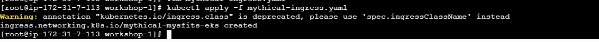

In path : ~/environment/workshop-1/app/monolith-service/service/mythicalMysfitsService.py

uncomment the following section:

app.route("/mysfits/<mysfit_id>/fulfill-like", methods=['POST'])
def fulfillLikeMysfit(mysfit_id):
    serviceResponse = mysfitsTableClient.likeMysfit(mysfit_id)
    flaskResponse = Response(serviceResponse)
    flaskResponse.headers["Content-Type"] = "application/json"
    return flaskResponse

Now comment out the "like" function.

# increment the number of likes for the provided mysfit.
# @app.route("/mysfits/<mysfit_id>/like", methods=['POST'])
# def likeMysfit(mysfit_id):
    # serviceResponse = mysfitsTableClient.likeMysfit(mysfit_id)
    # process_like_request()
    # flaskResponse = Response(serviceResponse)
    # flaskResponse.headers["Content-Type"] = "application/json"
    # return flaskResponse

With this new functionality added to the monolith, rebuild the monolith docker image with a new tag, such as nolike, and push it to ECR just as before:

cd ~/environment/workshop-1/app/monolith-service
MONO_ECR_REPOSITORY_URI=$(aws ecr describe-repositories | jq -r .repositories[].repositoryUri | grep mono)
docker build -t monolith-service:nolike .
docker tag like-service:latest 716713632458.dkr.ecr.us-east-1.amazonaws.com/nolike-service:latest
docker push 716713632458.dkr.ecr.us-east-1.amazonaws.com/nolike-service:latest

The source code for the “like” service has been provided. Use the following commands to build it into a container image and push it into ECR:

cd ~/environment/workshop-1/app/like-service
LIKE_ECR_REPOSITORY_URI=$(aws ecr describe-repositories | jq -r .repositories[].repositoryUri | grep like)
docker build -t like-service .
docker tag like-service:latest 716713632458.dkr.ecr.us-east-1.amazonaws.com/like-service:latest
docker push 716713632458.dkr.ecr.us-east-1.amazonaws.com/like-service:latest

The monolith has been decomposed into two microservices—like and nolike. Each service is deployed independently on Amazon EKS, with traffic managed through the AWS Load Balancer Controller.

# MicroService Architecture 

Users
  |
  v
Amazon S3 (Static Content / API Trigger)
  |
  v
Application Load Balancer (ALB)
  |
  +----------------------+
  |                      |
  v                      v
Monolith Service     Like Microservice
(EKS - Private)      (EKS - Private)
  |                      |
  |                      v
  |                Amazon DynamoDB
  |
  v
Amazon CloudWatch (Logs & Metrics)

# Steps

- Users access the application

- Static assets or requests go through Amazon S3

- Traffic is routed via an Application Load Balancer

- Requests are handled by: Monolith service (existing application)/Like microservice (newly extracted feature)

- Both services run on Amazon EKS in private subnets

- The Like microservice stores data in Amazon DynamoDB

- Amazon ECR stores container images

- Amazon CloudWatch collects logs and metrics

# Deploy to EKS

- Load manifest file for likeservice-app

kubectl apply -f likeservice-app.yaml

- Load manifest file for nolikeservice-app

kubectl apply -f nolikeservice-app.yaml

kube

# To Check Deployment logs :

kubectl logs deployments/mythical-mysfits-nolike
kubectl logs deployments/mythical-mysfits-like

# To Create Ingress

This manifest (mythical-ingress.yaml ) will create a Kubernetes ingress object, which will in turn trigger the creation of an Application Load Balancer  (ALB), giving the path to the two microservices that we have created (like and nolike)

Apply the manifest to the Kubernetes API and view the configuration information for the ingress:

kubectl apply -f mythical-ingress.yaml
kubectl get ingress/mythical-mysfits-eks

# Ingress Logs

kubectl logs -n kube-system deployments/aws-load-balancer-controller -f

Update the like service with ALB DNS name by modifying the likeservice-app.yaml file

containers:
        - name: mythical-mysfits-like
          image: 138284551145.dkr.ecr.us-west-2.amazonaws.com/containersid-like-52bubwawf1i0:latest
          imagePullPolicy: Always
          ports:
            - containerPort: 80
              protocol: TCP
          env:
            - name: MONOLITH_URL
              value: k8s-default-mythical-e376a58c30-1531749183.us-west-2.elb.amazonaws.com (Your ALB name would be different)

# Re-deploy the "like" service:
kubectl apply -f likeservice-app.yaml

# Check ALB in ec2 console 

Once the state of the pods is showing as healthy,

kubectl get pods #(there should be 4 pods)
kubectl logs deployments/mythical-mysfits-nolike
kubectl logs deployments/mythical-mysfits-like

