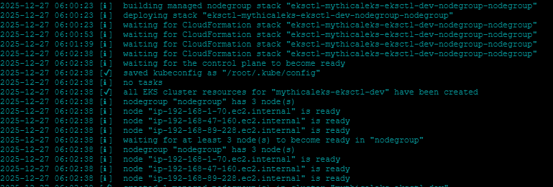

# Create ec2 instancetype - t3.medium for better performance
# App folder : cd ~/environment/workshop-1/app/monolith-service/

Tip : Configure your AWS Credentials by using this command - aws configure

- Create Kube.sh and copy the following code and execute, binaries should installed successfully

- Execute mythicaleks.yaml file , execute - eksctl create cluster -f mythicaleks.yaml 

# At this point you have two stacks in CloudFormation a) eksctl-mythicaleks-eksctl-dev-nodegroup-nodegroup
b)eksctl-mythicaleks-eksctl-dev-cluster

 - kubectl get nodes ( Amazon EKS Cluster that is ready to use!)

 #  Provision AWS Load Balancer Controller to expose the application services.

 - Install EKS Pod Identity Agent : eksctl create addon --cluster mythicaleks-eksctl --name eks-pod-identity-agent

 

 - Download the IAM policy for the AWS Load Balancer Controller: curl -o iam-policy.json https://raw.githubusercontent.com/kubernetes-sigs/aws-load-balancer-controller/main/docs/install/iam_policy.json

 - Create an IAM role for the AWS Load Balancer Controller: # Create the IAM policy
aws iam create-policy --policy-name AWSLoadBalancerControllerIAMPolicy --policy-document file://iam-policy.json

- Create Trust Policy
# Create IAM role with trust policy for Pod Identity
cat > trust-policy.json <<EOF
{
  "Version": "2012-10-17",
  "Statement": [
    {
      "Effect": "Allow",
      "Principal": {
        "Service": "pods.eks.amazonaws.com"
      },
      "Action": [
        "sts:AssumeRole",
        "sts:TagSession"
      ]
    }
  ]
}
EOF

- aws iam create-role --role-name AWSLoadBalancerControllerRole --assume-role-policy-document file://trust-policy.json

- # Attach the policy to the role
export PolicyARN=$(aws iam list-policies --query 'Policies[?PolicyName==`AWSLoadBalancerControllerIAMPolicy`].Arn' --output text)
aws iam attach-role-policy --role-name AWSLoadBalancerControllerRole --policy-arn $PolicyARN

# Create a kube service account and associate it with the IAM role using Pod Identity:
# Create the service account
kubectl create serviceaccount aws-load-balancer-controller -n kube-system

# Create Pod Identity association
aws eks create-pod-identity-association \
    --cluster-name mythicaleks-eksctl \
    --namespace kube-system \
    --service-account aws-load-balancer-controller \
    --role-arn arn:aws:iam::$(aws sts get-caller-identity --query Account --output text):role/AWSLoadBalancerControllerRole

TIP : What is this doing?
This creates a service account in the kube-system namespace and associates it with the IAM role using EKS Pod Identity. The Pod Identity agent will automatically provide the necessary credentials to pods using this service account.

